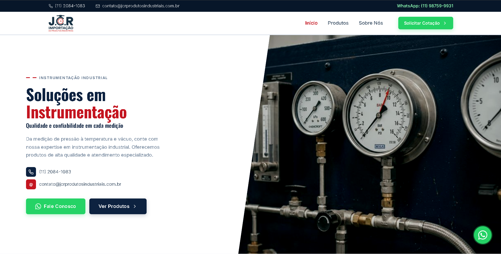
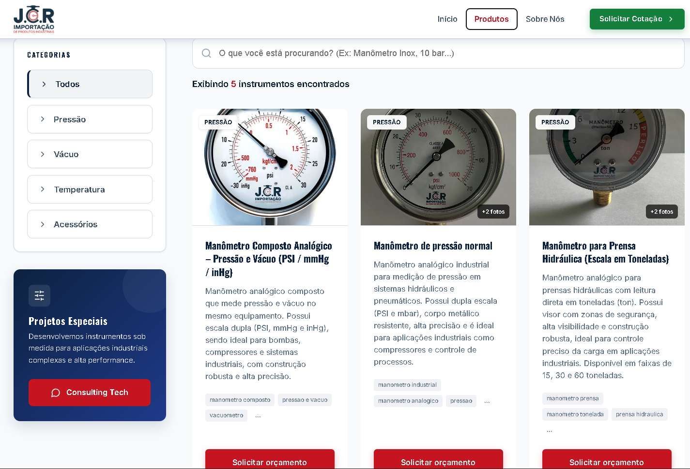

# ⚙️ JCR Produtos Industriais — Plataforma de Gestão e Catálogo Industrial em Cloud

> Projeto de Extensão — Análise e Desenvolvimento de Sistemas — 5º Semestre — UNINOVE (2026)

---

## 🔗 Links de Avaliação

| Recurso                       | Link                                                                                                    |
| :---------------------------- | :------------------------------------------------------------------------------------------------------ |
| 🌐 **Sistema em Produção**    | https://projeto-2026-5-semestre-jcr-importa.vercel.app/                                                 |
| 📹 **Vídeo de Apresentação**  | https://youtu.be/_B5MDMZN5bc                                                                            |
| 📂 **Repositório GitHub**     | https://github.com/LuisGustavoCassioli/PROJETO-2026--5-SEMESTRE---JCR-IMPORTA-O-DE-PRODUTOS-INDUSTRIAIS |
| 📄 **Documentação Acadêmica** | https://github.com/LuisGustavoCassioli/PROJETO-2026--5-SEMESTRE---JCR-IMPORTA-O-DE-PRODUTOS-INDUSTRIAIS/blob/main/public/DOCUMENTO%20PROJETO%20FINAL%20-%20JCR.pdf                                                      |
| 🖼️ **Banner do Projeto**     | https://github.com/LuisGustavoCassioli/PROJETO-2026--5-SEMESTRE---JCR-IMPORTA-O-DE-PRODUTOS-INDUSTRIAIS/blob/main/public/banner%20(3).pdf                                                                              |

---

## 🎯 O Problema e a Solução

A **JCR Importação de Produtos Industriais** operava com um site estático legado, sem painel de gestão, difícil de atualizar e sem suporte mobile. O projeto de extensão entregou uma plataforma cloud moderna, escalável e com gestão completa de produtos e leads.

---

## 👥 Squad JCR (Grupo 6)

| Nome                                          | RA         |
| --------------------------------------------- | ---------- |
| Carlos Henrique Gomes Santos                  | 3026106005 |
| Eduardo Freitas de Castro                     | 3024105801 |
| Lucas Nunes                                   | 3026105890 |
| **Luis Gustavo Cassioli Rodrigues** *(Líder)* | 3023204201 |
| Paulo Nlandu Onde Mavuba                      | 3026106430 |
| Samuel de Lucas Silva                         | 3024105321 |

---

## 🏗️ Stack Tecnológica

| Camada             | Tecnologia                             |
| ------------------ | -------------------------------------- |
| **Frontend**       | React 18 + TypeScript + Vite           |
| **Backend (BaaS)** | Supabase (PostgreSQL + Auth + Storage) |
| **Hospedagem**     | Vercel (CI/CD automático via GitHub)   |
| **Estilização**    | CSS moderno + Design System próprio    |

---

## 📸 Demonstração do Sistema

### 🏠 Home Page (Hero & Institucional)



### 📦 Catálogo de Produtos (Filtros e Busca)


---

## ✅ MVP — Funcionalidades Entregues

### 🌐 Sistema Público (Cliente)

* Catálogo de produtos com busca em tempo real e filtros por categoria
* Cards de produto com galeria de imagens
* Formulário de lead integrado ao banco de dados (Supabase)
* Botão "Solicitar Orçamento" via WhatsApp
* Design responsivo (desktop, tablet e mobile)

### 🔐 Sistema Administrativo (Restrito à Equipe JCR)

* **Acesso:** `/acesso-interno` (login no padrão interno)
* CRUD completo de produtos
* Upload de múltiplas imagens (Supabase Storage)
* Gestão de leads
* Perfis de acesso: **admin (mestre)** e **staff (equipe)**
* Cadastro controlado por whitelist de e-mails

### 🛡️ Segurança

* Row Level Security (RLS) no banco de dados
* Funções SQL (`is_admin()` e `is_staff()`) para controle de acesso
* `search_path` fixo em funções críticas
* Uso exclusivo de variáveis de ambiente (sem dados sensíveis no código)

---

## 🚀 Como Executar Localmente

```bash
# 1. Clonar o repositório
git clone https://github.com/LuisGustavoCassioli/PROJETO-2026--5-SEMESTRE---JCR-IMPORTA-O-DE-PRODUTOS-INDUSTRIAIS.git

# 2. Instalar dependências
npm install

# 3. Configurar variáveis de ambiente (.env)
VITE_SUPABASE_URL=sua_url_aqui
VITE_SUPABASE_ANON_KEY=sua_chave_aqui

# 4. Rodar em desenvolvimento
npm run dev

# 5. Build de produção
npm run build
```

---

## 📂 Estrutura do Repositório

```bash
/src
  /components   → Componentes reutilizáveis (UI)
  /pages        → Páginas da aplicação
  /services     → Integrações com APIs / Supabase
  /hooks        → Custom hooks React
  /types        → Tipagens TypeScript
  /utils        → Funções auxiliares
/public         → Arquivos estáticos
```

---

## 📌 Considerações Finais

Este projeto aplica conceitos modernos de engenharia de software, incluindo arquitetura baseada em serviços, segurança em nível de banco de dados e integração contínua.

A solução desenvolvida resolve limitações do sistema legado e estabelece uma base escalável para evolução futura da plataforma.

---

## 👨‍💻 Autoria

Projeto desenvolvido pelo Squad JCR, como parte do Projeto de Extensão do curso de Análise e Desenvolvimento de Sistemas — UNINOVE.

Liderança técnica, arquitetura e desenvolvimento principal:  
**Luis Gustavo Cassioli Rodrigues**
